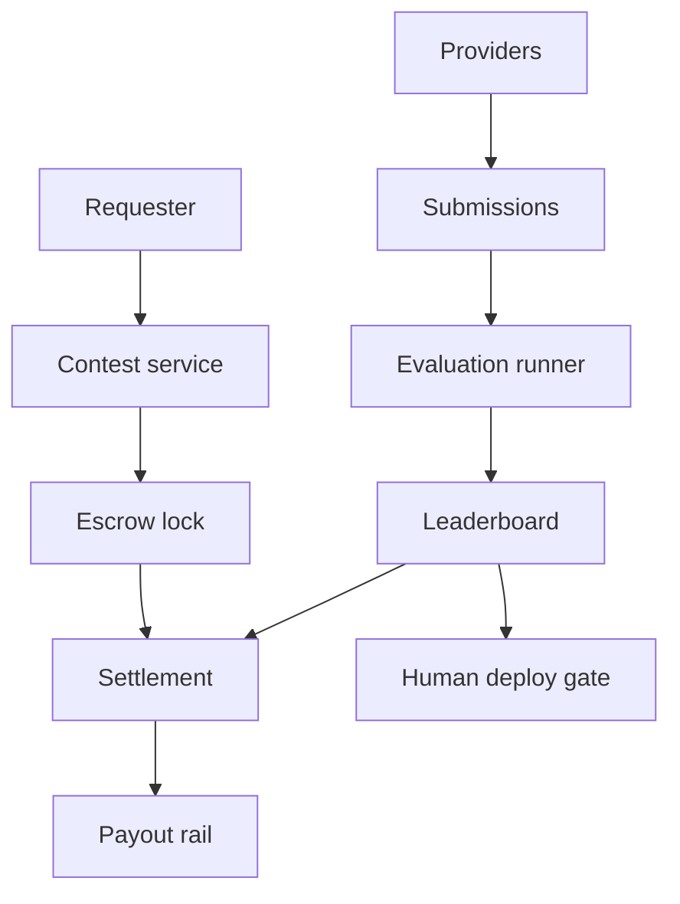

# Modelescrow

**Source:** `ai-in-decentralized+ai/Algorythmia-Blog-Archives/`
**Domain:** `ai-decentralized`
**One-liner:** A trustless model bounty desk where requesters escrow a reward against a dataset hash and evaluation function, providers submit models, and settlement pays winners from independent evaluation — not from a platform’s private opinion.
**Wedge:** Applied-ML teams buying external model improvements for a fixed task (vision, NLP, ranking) who distrust black-box freelance platforms — starting with public evaluation metrics and on-chain or notarised escrow release.
**Positioning:** Crypto-economic model exchange. The Algorithmia archive’s distinctive posts centre on “Trustless Machine Learning Contracts: Evaluating and Exchanging Machine Learning Models on the Ethereum Blockchain” and results from the first such contract, alongside a broader marketplace thesis of discoverable, composable algorithms deployed as microservices with humans in the loop.

## Market research synthesis

### Thesis from source

The source is an Algorithmia Blog Archive spanning 2016–2018. While many entries are tutorials, the differentiating product thesis clusters on trustless ML contracts and marketplace deployment. February 2018 announces trustless machine learning contracts for evaluating and exchanging models on Ethereum; April 2018 follows with results of the first trustless ML contract. Adjacent archive themes reinforce the commercial shape: deploying AI at scale, algorithm marketplace messaging (“Need Some AI? Yeah, There’s a Marketplace for That”), making algorithms discoverable and composable, MLaaS with sklearn, DevOps for AI / “AI Layer,” building an operating system for AI, serverless microservices for models, and humans-in-the-loop machine learning.

The implied failure mode of centralised model marketplaces is evaluation capture: the platform both brokers and judges. Trustless contracts separate reward escrow, model submission, and objective evaluation so settlement does not require trusting a single operator’s score. The archive’s deployment narrative adds that winning artefacts still need to ship as callable services with operational controls — escrow alone is not MLOps.

### Buyer & economic model

- **Primary buyer:** Head of Applied ML / marketplace program manager funding external model bounties.
- **Users:** contest requesters, model providers, evaluation operators, security reviewers, finance (escrow release).
- **Budget owner / value metric:** R&D / vendor budget; value metric is verified metric lift per dollar escrowed and dispute rate.
- **Competing status quo:** Kaggle-style leaderboards without enforceable payout, Upwork model gigs, or centralised API marketplaces that score privately.

### Domain constraints

- **Regulatory / trust / safety:** dataset licensing; model IP; sanctions on payouts; evaluation gaming; need for human review before production deploy.
- **Data sensitivity:** datasets may be private — hash and sealed evaluation environments rather than public dumps when required.
- **Change-management realities:** providers want fast feedback; requesters want fraud-resistant payouts; both need clear dispute rules.

## Business requirements

- BR-1: A contest must specify dataset identifier/hash, evaluation function, acceptance metric, reward amount, and submission deadline before escrow can lock.
- BR-2: Escrowed rewards must release only to submissions that pass the published evaluation, or return to requester on expiry/cancel per rules.
- BR-3: Evaluation must be reproducible from recorded environment and metric definitions; operator cannot silently change scores post hoc.
- BR-4: Private-dataset contests must support sealed evaluation without giving providers raw download when policy forbids it.
- BR-5: Winning artefacts must be deliverable as versioned model packages suitable for microservice deployment.
- BR-6: Humans-in-the-loop review must be optionally required before production promotion even after metric win.
- BR-7: Disputes on evaluation integrity must be time-boxed with evidence from the evaluation log.
- BR-8: Fee/take-rate must be disclosed separately from the escrowed reward.
- BR-9: Federated training and GDPR erasure are out of scope.
- BR-10: Provider identity and payout rails must support compliance checks before release.
- BR-11: Leaderboards may be public or private per contest policy.
- BR-12: Audit exports must tie contest rules, submissions, scores, and payout tx references.

## User stories

Canonical user stories live in sibling [USER_STORIES.md](USER_STORIES.md).

## System design

### Overview

Modelescrow hosts contests, locks escrow, accepts submissions, runs or attestates evaluations, ranks results, and settles payouts. Optional promotion hooks push winners toward microservice deployment registries with human approval.

### Actors & boundaries

- **Actors:** requesters, providers, evaluators, compliance, admins.
- **Trust boundary:** escrow and evaluation logs are the neutral zone; raw private datasets stay in sealed evalers.
- **Human-in-the-loop points:** production promotion, dispute resolution, compliance clearance, invalidation for cheating.

### Core capabilities

1. **Contest publication and rules**
2. **Escrow lock and release**
3. **Submission intake**
4. **Independent evaluation and leaderboard**
5. **Dispute handling**
6. **Payout settlement**
7. **Optional deploy-gate to microservices**

### Conceptual data

- **Primary entities:** Contest, Escrow, Submission, EvaluationRun, LeaderboardEntry, Dispute, Payout, DeployGate.
- **Critical events:** published, escrowed, submitted, evaluated, disputed, paid, returned, promoted.
- **Retention / audit needs:** rules, scores, and payout references retained for financial and IP dispute windows.

### Integrations (conceptual)

- **Systems of record:** object storage for artefacts, payment/escrow rails, model registry, IAM.
- **Upstream signals:** dataset catalogues, CI eval runners.
- **Downstream actions:** payout execution, webhook to deploy pipelines.

### High-level architecture

### Success metrics

- **Leading:** escrow funded rate; median time to first valid submission; evaluation reproducibility checks passed.
- **Lagging:** dispute rate; verified metric lift on requester holdout; provider repeat participation; take-rate vs centralised marketplaces.

## OpenAPI

Canonical HTTP surface lives under [`packages/openapi-core/src/`](packages/openapi-core/src/) (one YAML per domain). Summary:

- **Base path:** `/v1/...` (identity blueprint remains `/v0/...`)
- **Auth:** API key / Bearer JWT
- **Domains:** Contests, Submissions, Evaluations, Escrows, Settlements, Disputes, DeployGates (+ Identity)
