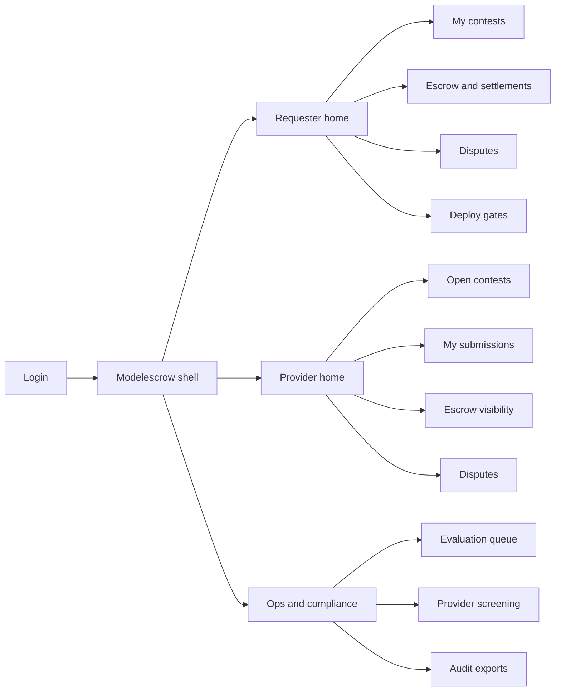
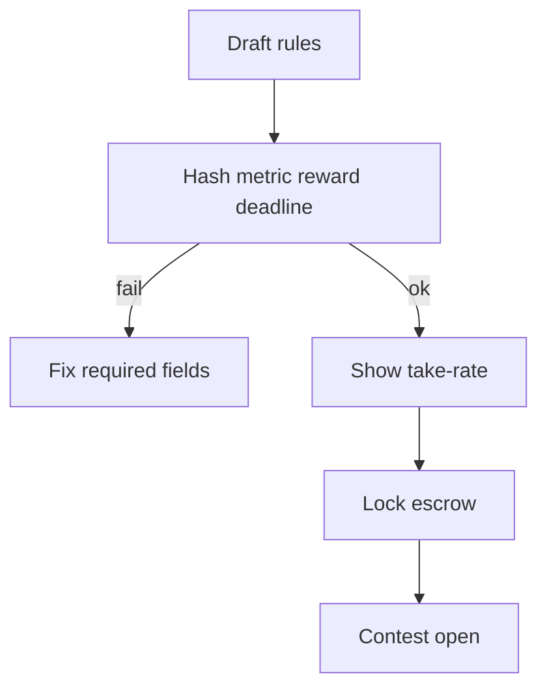
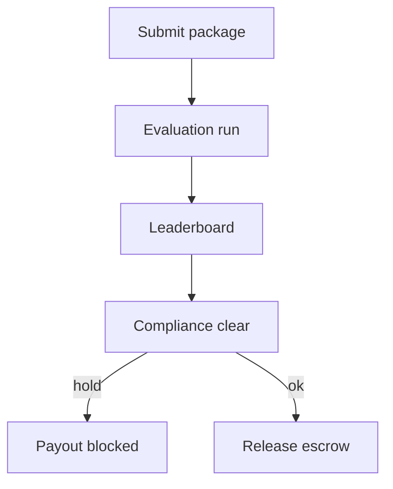

# Modelescrow — Web app

**Product:** [PRODUCT.md](./PRODUCT.md)
**Primary surface:** Dual-sided bounty desk (Requester workspace + Provider workspace under one Modelescrow shell)
**Secondary surfaces:** Public contest leaderboard (policy-gated); settlement attestation export (read-only PDF/CSV)
**Design thesis:** Modelescrow is an escrow desk for model lift — not a social leaderboard or freelance marketplace. The UI metaphor is a sealed auction floor with a locked purse and an independent scoreboard: rules and metric definitions feel immutable once escrow locks; scores feel reproducible; payouts feel dual-controlled. Visual language is cool graphite with escrow-amber for locked capital and metric-teal for verified pass — the brand wordmark sits as a quiet mint seal on every money-bearing screen so requesters and providers know whose neutrality they are trusting.

## UX research synthesis

### Category peers (best-in-class)

- **Kaggle Competitions:** Rules-first contest pages, deadline clocks, public/private leaderboard split, notebook/submission history. Steal: metric + data hash as first-class chrome on the contest header; reject Kaggle’s “prize may be paid by sponsor discretion” ambiguity — Modelescrow payout is escrow-bound.
- **Numerai Tournament:** Crypto-economic staking, transparent score history, round clocks. Steal: capital-at-risk visibility before providers invest compute; reject Numerai’s opaque meta-model aesthetics where Modelescrow needs reproducible EvaluationRun logs.
- **Hugging Face Hub (model cards + Spaces):** Versioned artefacts, licence/metadata, deployable packages. Steal: submission as a versioned model package with deploy-gate, not a zip dump; reject Hub’s social discovery feed as the primary operator home.
- **Algorithmia Classic marketplace (historical):** Discoverable algorithms as microservices, humans-in-the-loop. Steal: “winning artefact → callable service” promotion path; reject black-box platform scoring as the settlement authority.

### Patterns to adopt / reject

- **Adopt:** Escrow status as a first-class banner on every contest; immutable rules after fund lock; evaluation log drill-down from every leaderboard row; disclosed take-rate separate from reward; sealed-eval mode badges; human deploy-gate after metric win; time-boxed dispute with evidence panes.
- **Reject:** Private operator score edits without a new contest; “AI insights” glow panels; Upwork-style chat-as-contract; editable leaderboard totals; rainbow KPI tiles; chatbots as the contest builder.

### Trust, density, and workflow constraints from PRODUCT.md

Operators need finance-grade density around escrow and payout without leaking private datasets (BR-4): sealed contests show hash + eval environment, never raw download to providers. Evaluation must be reproducible (BR-3): metric definitions lock with the contest; post-hoc score changes are impossible in UI. Settlement is dual-controlled — evaluation pass plus compliance clearance (BR-2, BR-10). Human review before production promotion remains optional but visible (BR-6). Disputes are time-boxed with evaluation-log evidence (BR-7). Take-rate is disclosed separately from escrowed reward (BR-8).

## Information architecture

### Nav model

### Roles → default home

| Role | Default home | Why |
|------|--------------|-----|
| Applied ML requester / program manager | Requester home — funded contests + metric lift | Daily bounty and escrow focus (BR-1, BR-2) |
| Model provider | Open contests — escrow-funded board | Capital-real before compute investment |
| Evaluation operator | Evaluation queue | Immutable metrics + invalidation (BR-3) |
| Finance / compliance | Escrow and settlements / screening | Dual-control release (BR-10, BR-12) |
| Platform admin | Audit exports + take-rate policy | Disclosed economics (BR-8) |

### Cross-links to OpenAPI resources

| Nav area | OpenAPI tags / resources |
|----------|---------------------------|
| Contests, rules, leaderboard | Contests, Evaluations |
| Submissions | Submissions |
| Evaluation runs | Evaluations |
| Escrow lock / status | Escrows |
| Payouts, returns, take-rate | Settlements |

## Screen inventory

### Requester home

- **Purpose:** Answer “which bounties have real escrow and verified lift this cycle?” in one composition.
- **Entry:** Post-login for requester roles.
- **Layout regions:** Brand + workspace switcher; escrow summary (locked / released / returned); active contests table (metric, deadline, submission count, escrow state); alerts rail (disputes nearing deadline, compliance holds).
- **Primary actions:** Create contest; open funded contest; jump to open disputes.
- **Empty / loading / error:** Empty = guided “publish first contest + lock escrow”; loading = skeleton KPIs + table; error = retry with request id.
- **BR / story ties:** BR-1, BR-2; requester stories on escrow and sealed eval.

### Contest editor and rules

- **Purpose:** Specify dataset hash, evaluation function, acceptance metric, reward, deadline, and leaderboard policy before escrow can lock.
- **Entry:** Requester nav → Create / edit contest.
- **Layout regions:** Rules form (dataset id/hash, eval fn, metric, reward, deadline, public/private board); sealed-eval toggle; take-rate disclosure line; preview of provider-facing contest card.
- **Primary actions:** Save draft; lock escrow; cancel (pre-fund only).
- **Empty / loading / error:** Validation blocks lock until hash + metric + reward present; mid-flight rule edit disabled after fund.
- **BR / story ties:** BR-1, BR-8, BR-11.

### Escrow desk

- **Purpose:** Show locked capital, release conditions, return paths on expiry/cancel, and disclosed fees.
- **Entry:** Contest detail → Escrow; finance home shortcut.
- **Layout regions:** Escrow state machine (draft → locked → released/returned); reward vs take-rate split; payout rail status; tx references when settled.
- **Primary actions:** Fund lock; view release eligibility; export attestation.
- **Empty / loading / error:** Unfunded = amber “capital not real”; failed rail = coral blocking banner.
- **BR / story ties:** BR-2, BR-8, BR-12.

### Provider open contests

- **Purpose:** Browse escrow-funded contests with transparent metrics before investing compute.
- **Entry:** Provider default home.
- **Layout regions:** Filterable board (task type, metric, reward, sealed badge, deadline); contest card with escrow confirmation chip.
- **Primary actions:** Open contest; submit model; watch escrow status.
- **Empty / loading / error:** Empty = no funded contests; filter resets preserved.
- **BR / story ties:** Provider stories on escrow visibility.

### Submission intake

- **Purpose:** Accept versioned model packages suitable for microservice deployment.
- **Entry:** Contest → Submit; My submissions.
- **Layout regions:** Artefact upload / registry link; version metadata; licence/IP attestation; sealed-eval notice when raw data forbidden.
- **Primary actions:** Submit; withdraw before eval start; open evaluation log when ready.
- **Empty / loading / error:** Upload failure with checksum mismatch; sealed mode blocks data download CTA.
- **BR / story ties:** BR-4, BR-5.

### Leaderboard and evaluation log

- **Purpose:** Rank by published metric with reproducible EvaluationRun evidence — operator cannot silently change scores.
- **Entry:** Contest → Leaderboard; evaluation queue drill-down.
- **Layout regions:** Ranked table; selected row → evaluation environment, metric definition snapshot, log excerpts; invalidation reason codes.
- **Primary actions:** Open eval evidence; mark invalid (ops); open dispute (provider).
- **Empty / loading / error:** Evaluating = progress state; failed run = retry with frozen metric version.
- **BR / story ties:** BR-3, BR-7, BR-11.

### Disputes workspace

- **Purpose:** Time-boxed adjudication with evaluation-log evidence.
- **Entry:** Alerts, leaderboard row, or Disputes nav.
- **Layout regions:** Queue with deadline countdown; dual evidence panes (provider claim vs eval log); resolution log; escrow impact preview.
- **Primary actions:** Submit evidence; accept/reject; escalate to ops.
- **Empty / loading / error:** Empty = no open disputes; expired = locked resolution.
- **BR / story ties:** BR-7.

### Deploy gate

- **Purpose:** Optional human review before production promotion even after metric win.
- **Entry:** Contest winners → Deploy gate; requester alerts.
- **Layout regions:** Winner package summary; metric pass badge; review checklist; promote/hold with reason.
- **Primary actions:** Approve promote; hold for gaming review; webhook to registry.
- **Empty / loading / error:** No winners yet; registry webhook failure shown as blocking.
- **BR / story ties:** BR-5, BR-6.

### Compliance screening

- **Purpose:** Provider identity and payout-rail clearance before release.
- **Entry:** Ops / finance default for compliance roles.
- **Layout regions:** Pending clearance queue; provider profile; sanctions/check status; dual-control release toggle.
- **Primary actions:** Clear / hold; notify finance; attach audit note.
- **Empty / loading / error:** Empty queue = healthy message; hold blocks settlement UI.
- **BR / story ties:** BR-10.

### Audit export

- **Purpose:** Tie contest rules, submissions, scores, and payout tx references for financial/IP windows.
- **Entry:** Ops admin nav.
- **Layout regions:** Period picker; contest multi-select; export package preview (rules snapshot, scores, txs).
- **Primary actions:** Generate export; download attestation.
- **Empty / loading / error:** No settled contests in period.
- **BR / story ties:** BR-12.

## Key flows

1. **Publish and fund contest** — define rules → disclose take-rate → lock escrow → open to providers; failure: missing hash/metric blocks lock.

2. **Submit → evaluate → settle** — provider submits package → eval runner → leaderboard → compliance clear → payout; failure: invalidation or dispute holds release.

3. **Sealed evaluation** — private dataset contest → provider submits without raw download → sealed env scores → same leaderboard UX with sealed badge (BR-4).

4. **Dispute score** — provider opens dispute on EvaluationRun → time box → evidence → resolve or lock (BR-7).

5. **Human deploy gate** — metric winner → reviewer checklist → promote to microservice registry or hold for gaming (BR-6).

## Design system

### Tokens (CSS variables)

- `--color-ink: #E6EDF2` — primary text on dark ground
- `--color-slate-950: #0A1016` — app ground
- `--color-slate-900: #121A24` — panels
- `--color-slate-700: #2A3848` — rules/dividers
- `--color-teal: #2EC4A2` — metric pass / verified lift
- `--color-teal-dim: #1A6B58` — teal on dark
- `--color-amber: #E0A045` — escrow locked / provisional
- `--color-coral: #E85D4C` — dispute / compliance hold
- `--color-steel: #7A93A8` — secondary labels
- `--color-brand: #9FD4C4` — Modelescrow wordmark accent
- `--font-display: "IBM Plex Sans", sans-serif` — console chrome and KPIs
- `--font-mono: "IBM Plex Mono", monospace` — hashes, eval ids, tx refs
- `--space-1`…`--space-8`: 4px scale
- `--radius-sm: 4px`; `--radius-md: 8px` — sharp escrow desk, not pill-heavy
- `--motion-lock: 200ms ease-out` — escrow lock flash
- `--motion-pass: 180ms ease-out` — metric pass confirm
- `--motion-deadline: 240ms ease-in-out` — amber pulse on contest/dispute deadline
- Atmosphere: subtle horizontal ledger hairlines on slate-900; soft top vignette; no stock “AI brain” imagery in console.

### Typography & brand

- Display for KPI numerals and screen titles; mono for dataset hashes, EvaluationRun ids, payout tx refs.
- Brand wordmark left of shell chrome on every escrow/settlement view.
- Marketing/login shell: brand as hero; one headline (“Pay only for verified lift”); one CTA — no stat strips.

### Do / don’t

- **Do:** Treat post-fund rules as visually locked; show take-rate as one explicit line; dual-pane dispute evidence; sealed badge when raw data forbidden.
- **Don’t:** Purple AI glow; editable leaderboard scores; chat-as-contract primary UX; card grids for static metrics; emoji status.

### Accessibility & domain trust cues

- Contrast AA+ on teal/amber/coral against slate; settled/released rows also show lock icon + text.
- Live regions announce escrow lock, dispute deadlines, and compliance holds.
- Focus order follows money flow: rules → escrow → submissions → leaderboard → settlement.

## Component patterns

- **EscrowStateBanner** — locked / released / returned / held with capital amounts.
- **MetricDefinitionLock** — immutable metric + env snapshot after fund.
- **SealedEvalBadge** — private-dataset mode without download CTA.
- **EvaluationLogDrawer** — reproducible run evidence from leaderboard row.
- **TakeRateLine** — disclosed fee separate from reward.
- **DisputeDeadlineChip** — amber countdown; coral when overdue.
- **DeployGateChecklist** — human promotion after metric win.
- **SettlementAttestationExport** — rules + scores + tx refs package.

## Out of scope for v1 web

- Federated training UI; GDPR erasure workflows (BR-9); end-consumer model discovery social feed; native mobile trader apps; full CI/CD IDE for training; replacement of requester’s primary model registry.
